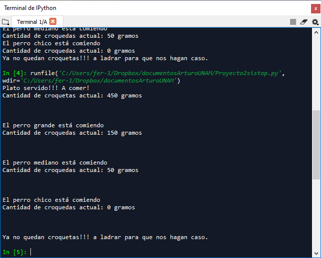
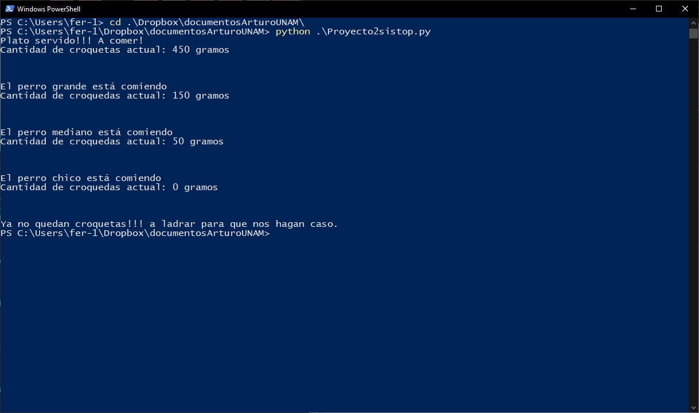
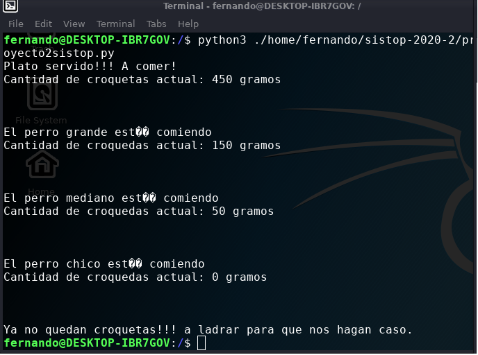

# Planteamiento
## EL PLATO DE COMIDA PARA PERROS
Como parte del planteamiento, se pretende establecer un ejemplo para la 
concurrencia con una situación cotidiana, en este caso la situación será planteada
con un caso personal, actualmente tengo tres perros, pero cada uno lo adopté en 
diferentes momentos, al primero y más grande lo tuvimos que educar para que solo
comiera en una parte de la casa y dentro de su plato, al segundo, en el momento de
su adopción no fue tan necesario adiestrarlo, ya que el más grande le enseñó las 
costumbres que tenía y al tercero de igual manera aprendió por imitación, es por
ello que no se les compraron platos diferentes, entre otras razones, ya que todos 
comen a diferente hora.
Sin embargo, hay ocasiones en las que los tres perros desean alimentarse al mismo 
momento, pero entre ellos no les gusta que comer al mismo tiempo en el mismo plato
porque pueden llegar a agredirse, en este entendido, los tres tienen que 
coordinarse para que todos coman, se les sirve alimento suficiente tres veces al 
día, por lo que deben de esperar a que uno acabe y así poder comer, como un 
agregado, cada perro debe de comer su porción correspondiente a su tamaño, 
el grande puede consumir hasta 300 gramos por ocasión, el intermedio debe comer 
100 gramos y el más pequeño 50 gramos. En caso de que uno de ellos no consuman su 
alimento, el plato no se volverá a surtir hasta que quede vacío.

# Documentación
## Descripción de los mecanismos de sincronización empleados
Como sabemos, la concurrencia la definimos en clase como dos o más eventos que no
tienen un orden específico de ejecución. Sin embargo podemos presentarnos diversos
problemas al intentar accesar los eventos o hilos a una localidad de memoria 
específica o un mismo recurso, ya que todos ellos intentarán ejecutar una operación
en dicho recurso y éste puede ser alterado dándonos como resultado algo que no 
queremos o simplemente pueda ser ilegible en un lenguaje cotidiano, es por ello que
debemos de asegurar al atomicidad de nuestro recurso mientras es operado.
En el caso específico de la problemática planeteada pueden ser implementados 
diversos mecanismos de sincronización, en mi caso fue utilizada la de regiones de
exclusión mutua (candados o mutexes), ya que resulta muy sencillo definir el 
recusrso que será compartido por los perros y con ello sabemos cómo actuar al 
momento de que uno de ellos quiera alimentarse sin ser molestado por el otro.
Recordemos que el objetivo específico de este mecanismo de sincronización es el de
asegurar que cierta región de nuestro código será ejecutada como si fuese atómica, 
previniendo que la sección crítica sea intervenida por otro hilo. Reteniendo la 
sección antes de entrar a ella hasta que el proceso que la está ejecutando salga.
## Lógica de operación
Como se especifica en el código, el recurso a compartir será el plato en el que se
vierte la cantidad apropiada para que todos los perros se alimenten, siempre y 
cuando consuman la porción adecuada a su tamaño, es por ello que el plato será el
que se bloqueará al momento en el que uno de los perros quiera comer para así 
consumir los gramos requeridos y después este "liberará" el plato para que los 
demás consuman su porción, una vez terminado el alimento, se podrá rellenar el 
plato.
En éste caso específico, la variable que queremos proteger con nuestro mutex o 
"*plato*" será la cantidad de comida servida, ya que todos pueden tener acceso a 
ella, sin embargo tendrán que poseer el plato para comerla o disminuirla.
Al ser inicializado cada uno de los hilos o "*Perros*" tendrán como objetivo comer
por lo que se les especificará su recurso a compartir (plato), la cantidad de 
alimento que pueden comer por ocasión, y el tiempo que tardarán para consumir el
alimento.
Como el plato será muestro mutex, éste estará bloqueado mientras es utilizado por 
uno de los perros el tiempo especificado que tarda cada uno en comer, cuando éste 
sea liberado, cualquiera de los otros restantes podrá obtener el plato y comer de 
la misma manera.
## Descripción del entorno de desarrollo
*Lenguaje empleado: **Python** versión: **3**
*Bibliotecas empleadas: **threading** (Para la creación de los hilos), **time** (Para los 
tiempos de espera para el consumo)
*Sistemas operativos/distribuciones en los que fue probado: Windows 10, Kali Linux (WSL)
*Ejemplos:

