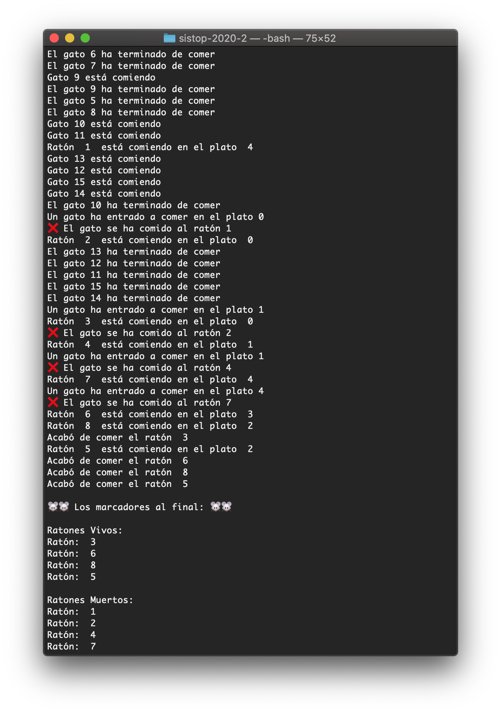

# Comer o ser comido 🐭 🐈
###Alumnos: 
- Garrido Sánchez Samuel Arturo
- Cárdenas Cárdenas Jorge


## Planteamiento 🍎

Tengo *k* gatos (y desafortunadamente, *l* ratones) en su casa. Le sirvo la comida a mis gatos en *m* platos.
Gatos y ratones han llegado a un acuerdo para repartirse el tiempo y comida, pero tienen que convencerme de que están haciendo su trabajo.

## Reglas ⭐️

Los gatos pueden comer de sus m platos de comida.
Los ratones pueden comer de esos mismos platos siempre y
cuando no sean vistos.
Si un gato ve a un ratón comiendo, se lo debe comer (para mantener su reputación)
Los platos están puestos uno junto al otro
Sólo un animal puede comer de cada plato a la vez
Si un gato está comiendo y un ratón comienza a comer de otro plato, el gato lo ve (y se lo come).
Por acuerdo de caballeros, los gatos no se van a acercar a los platos mientras hay ratones comiendo.

## Resolución 💡
Para el algoritmo fueron utilizadas 2 funciones principales, la creación de un comeGato() y comeRatón(). Dentro de comeRaton y comeGato la estrategia es seguir un Apagador ya que gatos y ratones no pueden convivir cuando están comiendo. Liberamos las condiciones cumpliendo las reglas planteadas con los mutex de gato y ratón, pero podemos liberar igual en otros instantes y es cuando los ratones pueden entrar y ser comidos por los gatos. Además igual se contempla a la cantidad de platos como Semáforo que puede alterar la ejecución de más hilos. Este tipo de resolución nos permite evitar la inanición. 

## Ejecución 🖥


## Requerimientos del sistema 🧩
Fue desarrollado utilizando el lenguaje de programación Python con las sigueintes características:

```
Python 3.6.5 (v3.6.5:f59c0932b4, Mar 28 2018, 03:03:55) 
[GCC 4.2.1 (Apple Inc. build 5666) (dot 3)] on darwin
```

Por lo que se recomienda ejecutarse en un Python 3 en algún entorno GNU/Linux o tipo UNIX.